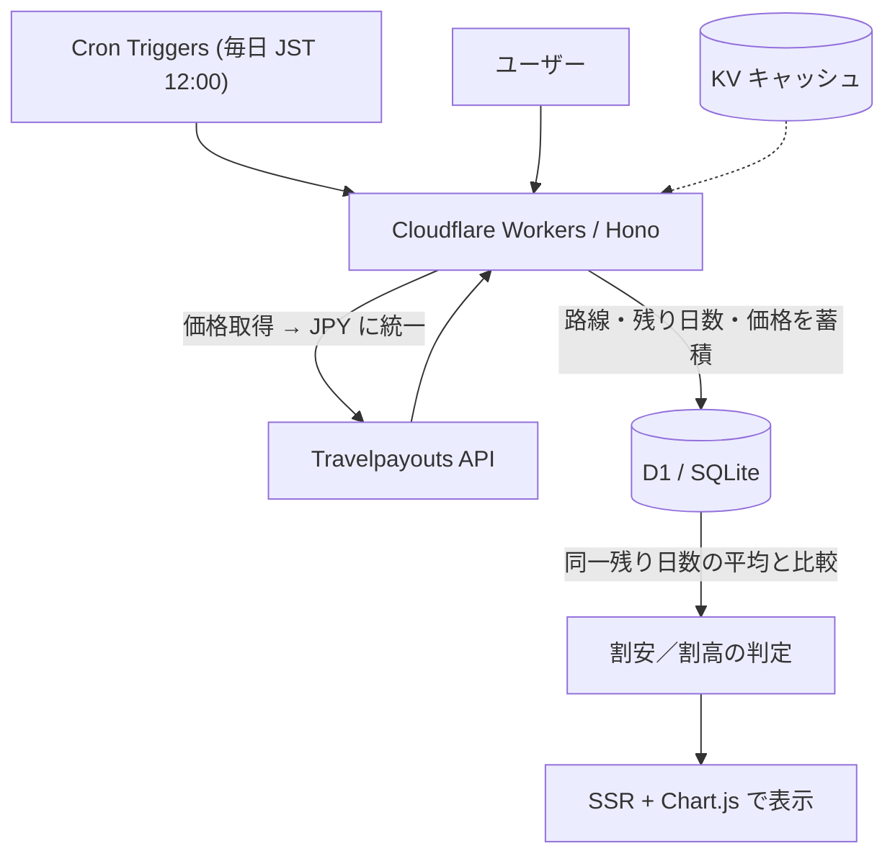

# SwimFare 🏊

> この値段だったら泳いで行きます

韓国〜日本の週末便について、「出発までの残り日数」を基準に過去の価格と比べ、当日の価格が割安か割高かを判定するWebサービスです。

🌐 **公開URL**：https://swimfare.cobalt-velvet.workers.dev

🌏 **言語**：日本語（このページ） ・ [한국어](./docs/README_ko.md) ・ [English](./docs/README_en.md)

---

## なぜ作ったか

航空券の価格は、出発日そのものよりも「出発までの残り日数」に大きく左右されます。出発が近づくほど運賃は上がる傾向があるため、単に最安値を並べるだけでは「その価格が高いのか安いのか」が分かりません。

SwimFare は比較の基準を **残り日数** に揃えます。「出発◯日前の価格」どうしを集めて平均を取ることで、「この週末の便は、いつものこの時期より安い／高い」という意味のある判定を行います。

## 主な機能

- 韓国〜日本の代表6路線の週末便を、毎日自動で収集
- 「路線・残り日数・価格」として時系列で蓄積
- 同一路線・同一残り日数の平均と当日価格を比較し、割安／割高を判定
- 明確に安い便（平均より10%以上安い）を含む路線をピンクのグラデーションで強調
- 価格推移のグラフ表示
- 日本語／韓国語の切替（ブラウザ言語の自動検出＋手動トグル）
- ライト／ダークテーマの切替（システム設定の自動検出＋手動トグル）
- 韓国発／日本発の方向切替（スライドアニメーション付きトグル）

## 対象路線

代表6路線を、韓国発・日本発の両方向で追跡します（計12路線）。

**韓国 → 日本**

| 出発 | 到着 | コード |
|------|------|--------|
| ソウル | 東京 | ICN-NRT |
| ソウル | 大阪 | ICN-KIX |
| ソウル | 福岡 | ICN-FUK |
| 釜山 | 東京 | PUS-NRT |
| 釜山 | 大阪 | PUS-KIX |
| 釜山 | 福岡 | PUS-FUK |

**日本 → 韓国**

| 出発 | 到着 | コード |
|------|------|--------|
| 東京 | ソウル | NRT-ICN |
| 大阪 | ソウル | KIX-ICN |
| 福岡 | ソウル | FUK-ICN |
| 東京 | 釜山 | NRT-PUS |
| 大阪 | 釜山 | KIX-PUS |
| 福岡 | 釜山 | FUK-PUS |

## 技術スタック

| 区分 | 使用技術 |
|------|----------|
| フレームワーク | [Hono](https://hono.dev/) |
| 実行環境 | Cloudflare Workers |
| データベース | Cloudflare D1 (SQLite) |
| キャッシュ | Cloudflare KV |
| バッチ処理 | Cloudflare Cron Triggers |
| 外部API | [Travelpayouts](https://www.travelpayouts.com/) / Aviasales Data API |
| フロントエンド | Hono JSX (SSR) + [Chart.js](https://www.chartjs.org/) |

## アーキテクチャ



- 価格はルーブル建てで返ることがあるため、保存前に必ず **JPY に統一** します。
- 判定には最低サンプル数（5件）を設け、不足する場合は「データ収集中」と正直に表示します。

## データモデル

価格レコードは「出発日（いつ発つか）」と「調査日（いつ確認したか）」の2軸で管理します。

| カラム | 内容 |
|--------|------|
| `route` | 路線（例：ICN-NRT） |
| `departure_date` | 出発日 |
| `observed_date` | 調査日（記録した日） |
| `days_before` | 残り日数（出発日 − 調査日） |
| `price` | 最安値（JPY） |
| `airline` | 航空会社（IATAコード） |

判定は、同一 `route` ・同一 `days_before` のレコードの平均を出し、当日価格と比較して行います。当日のレコード自身は平均に含めないため、データが薄い時期に当日の高値が平均を引き上げる現象を避けています。

## データに関する注記

価格データは Travelpayouts（Aviasales Data API）から取得します。これは利用者の検索履歴に基づくキャッシュであり、検索の少ない路線（釜山〜福岡など）はデータが空になることがあります。その場合、画面では「検索データが少なく収集中」と正直に表示します。

当初は Amadeus Self-Service API を検討していましたが、同サービスが2026年7月に終了予定だったため、登録が容易で終了予定のない Travelpayouts に切り替えました。

## セットアップ

```bash
# 依存関係のインストール
npm install

# ローカル開発
npm run dev

# デプロイ
npm run deploy
```

### 環境変数

| 変数名 | 内容 |
|--------|------|
| `TRAVELPAYOUTS_TOKEN` | Travelpayouts の API トークン（必須） |
| `ADSENSE_CLIENT_ID` | Google AdSense のクライアントID（任意） |
| `ADSENSE_SLOT_ID` | Google AdSense のスロットID（任意） |

ローカルでは `.dev.vars` に記載し、本番では `wrangler secret put` で登録します。AdSense は未設定の場合プレースホルダを表示します。

### シードデータの注入

```bash
npm run seed:local    # ローカル D1 にデモ用の合成データを投入
```

`npm run seed:remote` は **本番の当日 cron データを上書き** するため、明示的に環境変数を立てない限り拒否します：

```bash
# bash
SEED_REMOTE_CONFIRM=yes npm run seed:remote

# PowerShell
$env:SEED_REMOTE_CONFIRM='yes'; npm run seed:remote
```

## 今後の改善案

- 季節・曜日・連休などの要因を考慮した、より精緻な判定
- 韓国語表示での価格の₩換算
- 追跡路線の拡張
- 価格下落時の通知

## ライセンス

MIT
