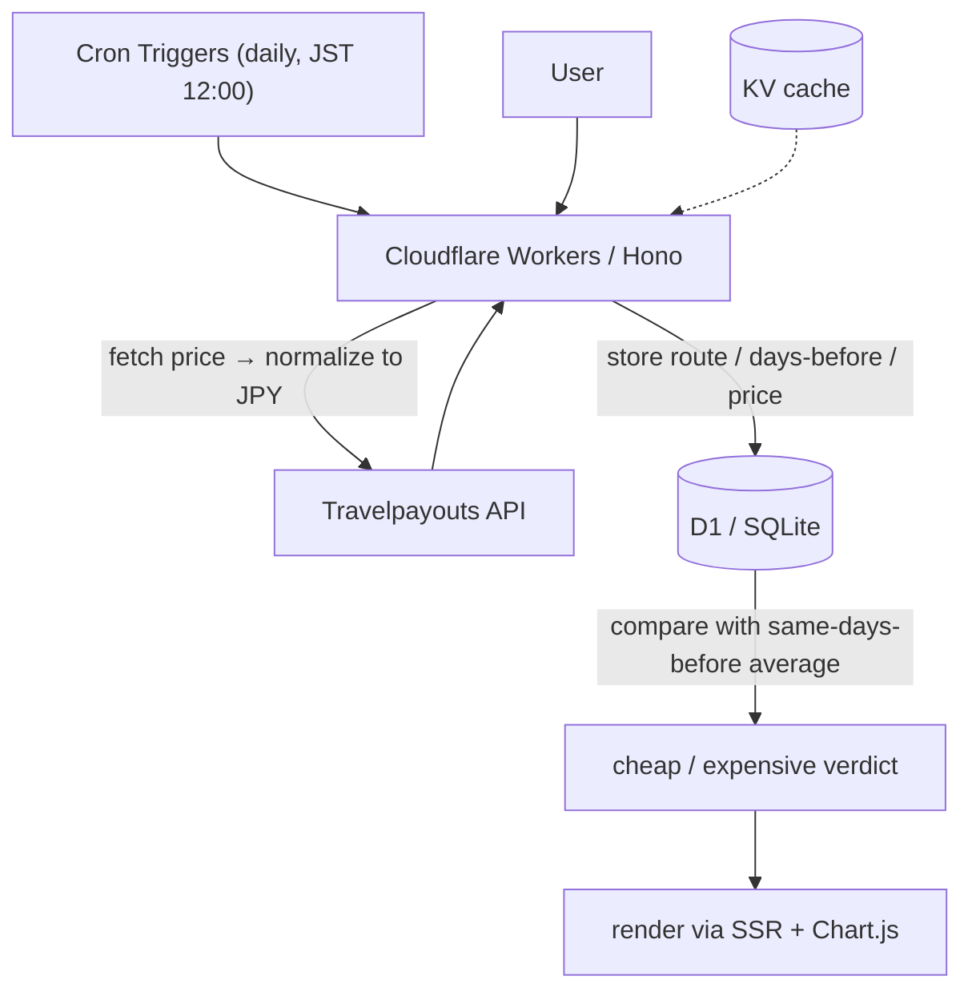

# SwimFare 🏊

> At this price, I'd swim there.

A web service that tells you whether today's price for a Korea–Japan weekend flight is cheap or expensive, by comparing it against past prices based on **days remaining until departure**.

🌐 **Live URL**: https://swimfare.cobalt-velvet.workers.dev

🌏 **Languages**: [日本語](../README.md) ・ [한국어](./README_ko.md) ・ English (this page)

---

## Why I built this

Flight prices depend less on the departure date itself than on **how many days remain until departure**. Fares tend to rise as departure approaches, so simply listing the lowest price tells you nothing about whether that price is actually good.

SwimFare aligns the comparison on **days remaining**. By collecting prices observed "N days before departure" and averaging them, it can give a meaningful verdict: "this weekend's flight is cheaper / more expensive than usual for this point in time."

## Features

- Automatically collects weekend flights for 6 major Korea–Japan routes every day
- Stores data as a time series of "route, days-before, price"
- Compares today's price against the average of the same route and same days-before to judge cheap / expensive
- Highlights routes containing a clearly cheap flight (10%+ below average) with a pink gradient
- Price trend charts
- Japanese / Korean switching (automatic browser-language detection + manual toggle)
- Light / dark theme switching (automatic system detection + manual toggle)
- Korea-origin / Japan-origin direction switching (toggle with slide animation)

## Tracked Routes

Six representative routes are tracked in both directions, Korea-origin and Japan-origin (12 routes total).

**Korea → Japan**

| From | To | Code |
|------|------|--------|
| Seoul | Tokyo | ICN-NRT |
| Seoul | Osaka | ICN-KIX |
| Seoul | Fukuoka | ICN-FUK |
| Busan | Tokyo | PUS-NRT |
| Busan | Osaka | PUS-KIX |
| Busan | Fukuoka | PUS-FUK |

**Japan → Korea**

| From | To | Code |
|------|------|--------|
| Tokyo | Seoul | NRT-ICN |
| Osaka | Seoul | KIX-ICN |
| Fukuoka | Seoul | FUK-ICN |
| Tokyo | Busan | NRT-PUS |
| Osaka | Busan | KIX-PUS |
| Fukuoka | Busan | FUK-PUS |

## Tech Stack

| Area | Technology |
|------|----------|
| Framework | [Hono](https://hono.dev/) |
| Runtime | Cloudflare Workers |
| Database | Cloudflare D1 (SQLite) |
| Cache | Cloudflare KV |
| Batch | Cloudflare Cron Triggers |
| External API | [Travelpayouts](https://www.travelpayouts.com/) / Aviasales Data API |
| Frontend | Hono JSX (SSR) + [Chart.js](https://www.chartjs.org/) |

## Architecture



- Prices may be returned in rubles, so they are always **normalized to JPY** before storage.
- A minimum sample size (5) is required for a verdict; otherwise the UI honestly shows "collecting data."

## Data Model

Each price record is managed on two axes: the **departure date** (when you fly) and the **observed date** (when the price was checked).

| Column | Description |
|--------|------|
| `route` | Route (e.g. ICN-NRT) |
| `departure_date` | Departure date |
| `observed_date` | Date the price was recorded |
| `days_before` | Days remaining (departure − observed) |
| `price` | Lowest price (JPY) |
| `airline` | Airline (IATA code) |

The verdict averages records with the same `route` and `days_before`, then compares against today's price. Today's own record is excluded from the average, avoiding the effect of a high current price inflating the mean when data is still sparse.

## A Note on Data

Price data comes from Travelpayouts (Aviasales Data API), a cache based on user search history. Routes with little search traffic (such as Busan–Fukuoka) may return no data, in which case the UI honestly displays "little search data, collecting."

Amadeus Self-Service API was considered first, but since that service is scheduled to shut down in July 2026, the project switched to Travelpayouts, which is easy to register for and has no planned shutdown.

## Setup

```bash
# Install dependencies
npm install

# Local development
npm run dev

# Deploy
npm run deploy
```

### Environment Variables

| Name | Description |
|--------|------|
| `TRAVELPAYOUTS_TOKEN` | Travelpayouts API token (required) |
| `ADSENSE_CLIENT_ID` | Google AdSense client ID (optional) |
| `ADSENSE_SLOT_ID` | Google AdSense slot ID (optional) |

Set these in `.dev.vars` locally, and via `wrangler secret put` in production. AdSense shows a placeholder when unset.

## Roadmap

- More refined verdicts accounting for season, day of week, and holidays
- KRW conversion for the Korean display
- More tracked routes
- Price-drop notifications

## License

MIT
