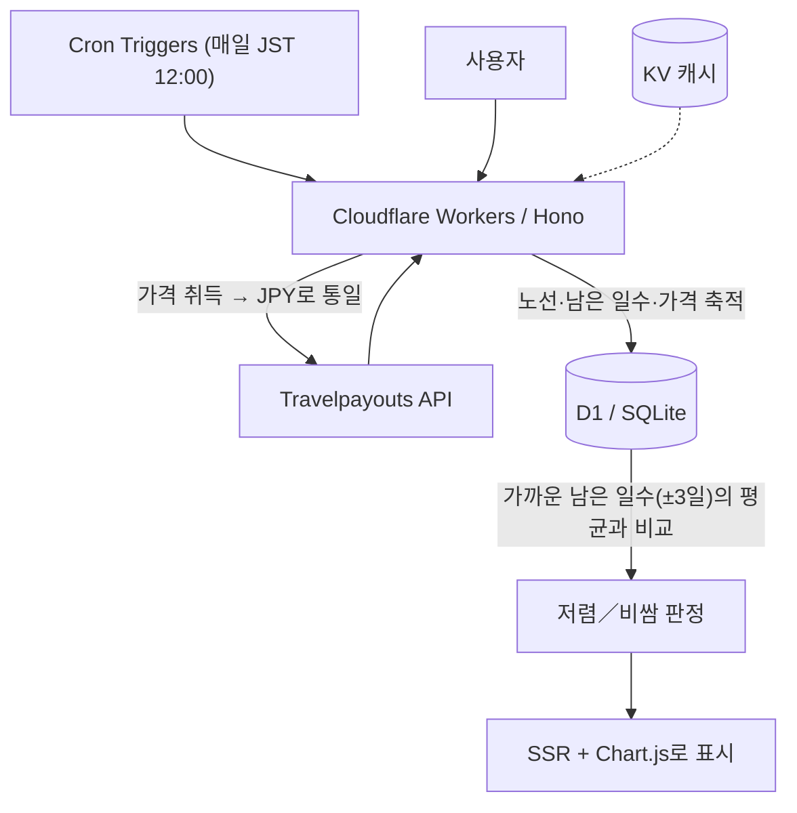

# SwimFare 🏊

> 이 가격이면 헤엄쳐서라도 갑니다

한국〜일본 주말 항공편에 대해, "출발까지 남은 일수"를 기준으로 과거 가격과 비교하여 오늘 가격이 저렴한지 비싼지 판정하는 웹 서비스입니다.

🌐 **공개 URL**：https://swimfare.cobalt-velvet.workers.dev

🌏 **언어**：[日本語](../README.md) ・ 한국어（현재 페이지） ・ [English](./README_en.md)

---

## 왜 만들었나

항공권 가격은 출발일 자체보다 "출발까지 남은 일수"에 크게 좌우됩니다. 출발이 가까워질수록 운임이 오르는 경향이 있어서, 단순히 최저가만 나열해서는 "이 가격이 비싼지 싼지"를 알 수 없습니다.

SwimFare는 비교 기준을 **남은 일수**로 맞춥니다. "출발 ◯일 전 가격"끼리 모아 평균을 내어, "이번 주말 항공편은 평소 이맘때보다 싼지/비싼지"를 의미 있게 판정합니다.

## 주요 기능

- 한국〜일본 대표 6개 노선의 주말 항공편을 매일 자동 수집
- "노선·남은 일수·가격"으로 시계열 축적
- 같은 노선에서 남은 일수가 가까운(±3일) 과거 가격의 평균과 오늘 가격을 비교해 저렴/비쌈 판정
- 확실히 싼 항공편(평균보다 10% 이상 저렴)이 있는 노선을 분홍 그라데이션으로 강조
- 가격 추이 그래프 표시
- 일본어／한국어 전환(브라우저 언어 자동 감지＋수동 토글)
- 라이트／다크 테마 전환(시스템 설정 자동 감지＋수동 토글)
- 한국발／일본발 방향 전환(슬라이드 애니메이션 토글)

## 대상 노선

대표 6개 노선을 한국발·일본발 양방향으로 추적합니다(총 12개 노선).

**한국 → 일본**

| 출발 | 도착 | 코드 |
|------|------|--------|
| 서울 | 도쿄 | ICN-NRT |
| 서울 | 오사카 | ICN-KIX |
| 서울 | 후쿠오카 | ICN-FUK |
| 부산 | 도쿄 | PUS-NRT |
| 부산 | 오사카 | PUS-KIX |
| 부산 | 후쿠오카 | PUS-FUK |

**일본 → 한국**

| 출발 | 도착 | 코드 |
|------|------|--------|
| 도쿄 | 서울 | NRT-ICN |
| 오사카 | 서울 | KIX-ICN |
| 후쿠오카 | 서울 | FUK-ICN |
| 도쿄 | 부산 | NRT-PUS |
| 오사카 | 부산 | KIX-PUS |
| 후쿠오카 | 부산 | FUK-PUS |

## 기술 스택

| 구분 | 사용 기술 |
|------|----------|
| 프레임워크 | [Hono](https://hono.dev/) |
| 실행 환경 | Cloudflare Workers |
| 데이터베이스 | Cloudflare D1 (SQLite) |
| 캐시 | Cloudflare KV |
| 배치 처리 | Cloudflare Cron Triggers |
| 외부 API | [Travelpayouts](https://www.travelpayouts.com/) / Aviasales Data API |
| 프런트엔드 | Hono JSX (SSR) + [Chart.js](https://www.chartjs.org/) |

## 아키텍처



- 가격이 루블로 반환될 수 있어, 저장 전에 반드시 **JPY로 통일**합니다.
- 판정에는 최소 표본 수(5건)를 두고, 부족하면 "데이터 수집 중"으로 정직하게 표시합니다.

## 데이터 모델

가격 레코드는 "출발일(언제 떠나는가)"과 "조사일(언제 확인했는가)"의 2축으로 관리합니다.

| 컬럼 | 내용 |
|--------|------|
| `route` | 노선(예：ICN-NRT) |
| `departure_date` | 출발일 |
| `observed_date` | 조사일(기록한 날) |
| `days_before` | 남은 일수(출발일 − 조사일) |
| `price` | 최저가(JPY) |
| `airline` | 항공사(IATA 코드) |

판정은 같은 `route`에서 오늘의 `days_before`를 중심으로 **±3일 허용 범위**에 들어오는 과거 레코드의 평균을 내어 오늘 가격과 비교합니다. 오늘 레코드 자신은 평균에 포함하지 않아, 데이터가 적은 시기에 오늘의 높은 값이 평균을 끌어올리는 현상을 피합니다.

> 허용 범위를 두는 이유는, 매일 "다음 4개의 토요일"을 수집하다 보니 `days_before`가 매일 1씩 어긋나 완전 일치로는 같은 값이 주 1회밖에 쌓이지 않기 때문입니다. ±3일 범위로 남은 일수가 가까운 관측을 묶어 샘플을 매일 축적합니다.

## 데이터에 관한 주의

가격 데이터는 Travelpayouts(Aviasales Data API)에서 가져옵니다. 이는 사용자 검색 기록 기반 캐시이며, 검색이 적은 노선(부산〜후쿠오카 등)은 데이터가 비어 있을 수 있습니다. 그 경우 화면에는 "검색 데이터가 적어 수집 중"으로 정직하게 표시합니다.

당초에는 Amadeus Self-Service API를 검토했으나, 해당 서비스가 2026년 7월에 종료 예정이어서, 등록이 쉽고 종료 예정이 없는 Travelpayouts로 전환했습니다.

## 셋업

```bash
# 의존성 설치
npm install

# 로컬 개발
npm run dev

# 배포
npm run deploy
```

### 환경 변수

| 변수명 | 내용 |
|--------|------|
| `TRAVELPAYOUTS_TOKEN` | Travelpayouts API 토큰(필수) |
| `ADSENSE_CLIENT_ID` | Google AdSense 클라이언트 ID(선택) |
| `ADSENSE_SLOT_ID` | Google AdSense 슬롯 ID(선택) |

로컬에서는 `.dev.vars`에 기재하고, 배포 환경에서는 `wrangler secret put`으로 등록합니다. AdSense는 미설정 시 플레이스홀더를 표시합니다.

## 향후 개선안

- 계절・요일・연휴 등의 요인을 고려한 더 정밀한 판정
- 한국어 표시에서 가격의 ₩ 환산
- 추적 노선 확장
- 가격 하락 시 알림

## 라이선스

MIT
